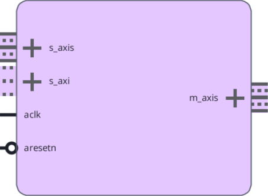

# Mini-ISP Documentation

# Introduction
A minimal, open-source Image Signal Processor (ISP) for AMD FPGA, implemented in Verilog.

Mini-ISP is a small open-source Image Signal Processor (ISP), completely implemented in programmable logic (PL). It is developed in Verilog RTL and optimized for AMD FPGA. It provides extremely high performance in terms of throughput and latency at an absolute minimum of required PL resources. The ISP ensures an acceptable image quality for a majority of applications.

The Mini-ISP philosophy is summarized as follows:

-	Minimal resources: Always use the absolute minimum number of resources.
-	Maximal performance: Provide the maximum possible performance in terms of pixel per second and latency.
-	Correct results: Ensure that the output is correct in any scenario.
-	Acceptable image quality: Image quality must be acceptable for most applications and subjectively pleasant to the human eye.
-	Open-source: All code and test cases are publicly available under a permissive license.

## Features

- Up to 2 Gpx/s processing - equivalent to 8K @60Hz, or 4K @240Hz
- Configurable 8 to 24 bit raw image processing
- RGB output: 8 bit or 10 bit per component
- 1, 2 or 4 pixel-per-cycle (PPC) processing
- AXI4 Stream Video Sink and Source
- AXI4 Lite Configuration Interface
- Fmax up to 500 Mhz (depending on fabric speed grade)
- Full image signal processing pipeline

## IP Facts
| IP Facts Table ||
|---|---|
| Supported Device Family | AMD Versal™ Adaptive SoC, AMD UltraScale+™ , AMD Zynq™ UltraScale+™ MPSoC, AMD Zynq™ UltraScale+™ RFSoC, AMD Zynq™ 7000 SoC, 7 series FPGAs, AMD Versal™ Premium Gen 2 |
| Supported User Interfaces | AXI4-Lite, AXI4-Stream |
| Resources | [Performance and Resource Utilization web page](./reports/isp_synthesis_report.md)

| Provided with this IP ||
|---|---|
| Design Files | Verilog, SystemVerilog, Python |
| Example Design | AMD Vivado™ IP integrator |
| Test Bench | Python (Cocotb) |
| Constraints File | Not Provided |
| Simulation Model | Python |
| Supported S/W Driver | Standalone (in Example Design) |

| Tested Design Flows ||
|---|---|
| Design Entry | AMD Vivado™ Design Suite |
| Simulation | Verilator, Cocotb |
| Synthesis | Yosys, AMD Vivado™ Synthesis |

| Support ||
|---|---|
| Release Notes and Known Issues | See Github Releases |
| Support | GitHub Issues |

# Overview

## Core Overview

The Mini-ISP core processes raw Bayer CFA data from an image sensor and produces RGB output. The processing pipeline consists of the following stages, connected in series with AXI4-Stream handshaking:

1. **Black Level Correction (BLC)** — Subtracts a configurable black level offset from the raw sensor data.
2. **Color Gain** — Applies per-channel multiplicative gains for white balance correction in the Bayer domain.
3. **Demosaic** — Interpolates missing color components using Malvar-He-Cutler ([MalvarHeCutler 2004](https://stanford.edu/class/ee367/reading/Demosaicing_ICASSP04.pdf)).
4. **Color Correction Matrix (CCM)** — Applies a 3×3 matrix multiplication to correct color response.
5. **Gamma LUT** — Performs gamma encoding using a lookup table.

Skid buffers are inserted between pipeline stages to decouple backpressure and improve timing closure. An AXI4-Lite register interface provides runtime access to all configuration parameters.

## Sub-Core Details

### Blacklevel Correction

The black level correction sub-core subtracts a configurable 16-bit offset value from each raw pixel. The result is saturated to zero to prevent underflow.

For resource utilization of this module, please refer to the [BLC Synthesis Report](./reports/blc_synthesis_report.md).

### Colorgain (White Balancing)

The color gain sub-core applies per-channel multiplicative gains to the Bayer CFA data for digital white balancing. Four independent 16-bit gain values are provided: RGAIN (red), BGAIN (blue), G0GAIN (green at position 0), and G1GAIN (green at position 1).

For resource utilization of this module, please refer to [Colorgain Synthesis Report](./reports/colorgain_synthesis_report.md).

### Demosaic

The demosaic sub-core interpolates missing color components at each pixel site to produce full RGB output from the Bayer CFA input. It implements a 5×5 context-based interpolation algorithm using four line buffers to maintain a sliding window of five rows. The algorithm uses weighted combinations of neighboring pixels to estimate the missing color values with high quality. The demosaic sub-core accounts for the CFA orientation parameter to correctly identify which color is present at each pixel site.

For resource utilization of this module, please refer to [Demosaic Synthesis Report](./reports/demosaic_synthesis_report.md).

### Color Correction Matrix (CCM)

The CCM sub-core applies a 3×3 color correction matrix to the RGB data. Each coefficient is a signed 16-bit fixed-point value in Q3.12 format. The matrix multiplication is performed per pixel:

$$
\begin{pmatrix} R_{out} \\ G_{out} \\ B_{out} \end{pmatrix} = \begin{pmatrix} CCM_{RR} & CCM_{RG} & CCM_{RB} \\ CCM_{GR} & CCM_{GG} & CCM_{GB} \\ CCM_{BR} & CCM_{BG} & CCM_{BB} \end{pmatrix} \cdot \begin{pmatrix} R_{in} \\ G_{in} \\ B_{in} \end{pmatrix}
$$

The default matrix is the identity (diagonal values of 1.0, off-diagonal values of 0). The coefficients are configured through the AXI4-Lite register interface.

For resource utilization of this module, please refer to [CCM Synthesis Report](./reports/ccm_synthesis_report.md).

### Gamma LUT

The gamma sub-core applies gamma encoding to each RGB component independently using a lookup table stored in block RAM. The LUT maps the input bit width (12 bits) to the output bit width (8 bits), implementing the sRGB transfer function. Three identical LUT instances are used in parallel, one for each color channel. The LUT contents are loaded from a memory initialization file at synthesis time.

For resource utilization of this module, please refer to [Gamma LUT Synthesis Report](./reports/gamma_synthesis_report.md).

## Applications

Mini-ISP is intended to be used in embedded applications that require raw camera Image Signal Processing, including:

- Machine vision and industrial inspection
- Surveillance and security cameras
- Automotive camera systems
- Drone and UAV imaging
- Medical imaging front-end processing

## Unsupported Features

Mini-ISP does currently not support:

- Auto White Balancing
- Auto Exposure Control
- Image Statistics
- HDR Merge
- HDR Tone Mapping
- Lens Shading Correction
- Contrast Enhancement (CLAHE)
- Multi-Camera Context
- Full configuration via Vivado IPI

## Licensing

Please refer to [LICENSE.md](https://www.github.com/amd/mini-isp/LICENSE.md).

# Product Specification

## Standards

AXI4 Stream input (raw data) and output (RGB) follow the [Vivado AXI Reference Guide UG1037 ](https://docs.amd.com/v/u/en-US/ug1037-vivado-axi-reference-guide), section "Video IP: AXI Feature Adoption".

## Performance

This section details the performance information for various core configurations.

### Latency

Mini-ISP introduces a latency of four image lines, and a number of clock cycles that depend on the actual configuration.

## Resource Utilization

For full details about performance and resource utilization, visit the [Performance and Resource Utilization web page](./reports/isp_synthesis_report.md).

## Port Descriptions

Mini-ISP features an AXI4-Stream Video Sink named *s_axis*, an AXI4-Stream Video Source named *m_axis*, an AXI4-Lite Memory-Mapped Register Interface named *s_axi*, a clock port *aclk*, and an active-Low reset input *aresetn*.

All interfaces are associated with the same clock, *aclk*, and the same reset, *aresetn*.



### AXI4 Stream Video Sink

The AXI4-Stream video sink interface `s_axis` receives raw Bayer CFA pixel data from an upstream video source. The interface follows the AXI4-Stream Video protocol as defined in the Vivado Design Suite: AXI Reference Guide (UG1037).

| Signal | Direction | Width | Description |
|---|---|---|---|
| s_axis_tdata | In | S_AXIS_DATA_WIDTH | Raw Bayer pixel data |
| s_axis_tvalid | In | 1 | Data valid |
| s_axis_tready | Out | 1 | Ready to accept data |
| s_axis_tlast | In | 1 | End of line |
| s_axis_tuser | In | TUSER_WIDTH | Start of frame |

The `S_AXIS_DATA_WIDTH` is calculated as $8 \cdot \lfloor (\mathtt{PIXEL\_PER\_CYCLE} \times \mathtt{PIXEL\_BIT\_WIDTH} + 7) / 8 \rfloor$.

!!! warning

    The output frame resolution is four columns and four rows smaller than the input frame resolution. This is because of the required 5x5 context for demosaicing. As an example, if Full-HD 1080p RGB output resolution (1920xx1080) is required, the input raw frames need to be of size 1924x1084.

### AXI4 Stream Video Source

The AXI4-Stream video source interface `m_axis` outputs processed RGB pixel data to a downstream video sink.

| Signal | Direction | Width | Description |
|---|---|---|---|
| m_axis_tdata | Out | M_AXIS_DATA_WIDTH | RGB pixel data |
| m_axis_tvalid | Out | 1 | Data valid |
| m_axis_tready | In | 1 | Downstream ready |
| m_axis_tlast | Out | 1 | End of line |
| m_axis_tuser | Out | TUSER_WIDTH | Start of frame |

The `M_AXIS_DATA_WIDTH` is calculated as $8 \cdot \lfloor (\mathtt{PIXEL\_PER\_CYCLE} \times 3 \times \mathtt{COMPONENT\_BIT\_WIDTH} + 7) / 8 \rfloor$.

!!! warning

    The output frame resolution is four columns and four rows smaller than the input frame resolution. This is because of the required 5x5 context for demosaicing. As an example, if Full-HD 1080p RGB output resolution (1920xx1080) is required, the input raw frames need to be of size 1924x1084.

### AXI Lite Memory-Mapped Register Interface

The AXI4-Lite slave interface `s_axi` provides read and write access to the ISP configuration registers. The interface uses a 32-bit data width and a 5-bit address width, providing access to 8 registers. All standard AXI4-Lite signals are supported including write strobes for byte-level write access.

| Signal | Direction | Width | Description |
|---|---|---|---|
| s_axi_awaddr | In | S_AXI_ADDR_WIDTH | Write address |
| s_axi_awvalid | In | 1 | Write address valid |
| s_axi_awready | Out | 1 | Write address ready |
| s_axi_wdata | In | 32 | Write data |
| s_axi_wstrb | In | 4 | Write strobes |
| s_axi_wvalid | In | 1 | Write data valid |
| s_axi_wready | Out | 1 | Write data ready |
| s_axi_bresp | Out | 2 | Write response |
| s_axi_bvalid | Out | 1 | Write response valid |
| s_axi_bready | In | 1 | Write response ready |
| s_axi_araddr | In | S_AXI_ADDR_WIDTH | Read address |
| s_axi_arvalid | In | 1 | Read address valid |
| s_axi_arready | Out | 1 | Read address ready |
| s_axi_rdata | Out | 32 | Read data |
| s_axi_rresp | Out | 2 | Read response |
| s_axi_rvalid | Out | 1 | Read data valid |
| s_axi_rready | In | 1 | Read data ready |

## Register Space

All ISP registers are shadowed and only applied at the next start-of-frame signal.

| Register Space |||
|---|---|---|
| 0x00 | RGAIN and BGAIN |  [31:16] BGAIN <br /> [15:0] RGAIN |
| 0x04 | G0GAIN and G1GAIN |  [31:16] G1GAIN <br /> [15:0] G0GAIN |
| 0x08 | CCM 0 | [31:16] CCM_R_G <br /> [15:0] CCM_R_R |
| 0x0C | CCM 1 | [31:16] CCM_G_R <br /> [15:0] CCM_R_B |
| 0x10 | CCM 2 | [31:16] CCM_G_B <br /> [15:0] CCM_G_G |
| 0x14 | CCM 3 | [31:16] CCM_B_G <br /> [15:0] CCM_B_R |
| 0x18 | BLACKLEVEL and CCM_B_B | [31:16] BLACKLEVEL <br /> [15:0] CCM_B_B |

### Color gains (white balancing)
The white balancing gains *RGAIN* (red gain), *BGAIN* (blue gain), *G0GAIN* (green at position 0 gain), and *G1GAIN* (green at position 1 gain) are in unsigned fixed-point UQ9.7 format. They default to 0x0080 (=128), representing a gain factor of 1.0 (neutral).

### Color Correction Matrix (CCM)
The coefficients of the Color Correction Matrix are organized as follows:

$$
\mathtt{CCM} = \begin{pmatrix}
\mathtt{CCM_{RR}} & \mathtt{CCM_{RG}} & \mathtt{CCM_{RB}} \\
\mathtt{CCM_{GR}} & \mathtt{CCM_{GG}} & \mathtt{CCM_{GB}} \\
\mathtt{CCM_{BR}} & \mathtt{CCM_{BG}} & \mathtt{CCM_{BB}}
\end{pmatrix}
$$

All coefficients are in signed fixed-point Q3.12 format. The diagonals $\mathtt{CCM_{RR}}$, $\mathtt{CCM_{GG}}$ and $\mathtt{CCM_{BB}}$ default to 0x1000 (=4096), representing a value of 1.0. All other coefficients default to 0 (neutral).

### Blacklevel Correction

The blacklevel correction is a 16 bit unsigned integer that is subtracted from the incoming raw data. Its correct setting depends on the image sensor that is used. Default is 0x0100 (=256).

# Designing with the IP Core

## General Design Guidelines

Mini-ISP is designed as a streaming core that processes pixels in raster-scan order. The following guidelines apply:

!!! warning

    The output frame resolution is four columns and four rows smaller than the input frame resolution. This is because of the required 5x5 context for demosaicing. As an example, if Full-HD 1080p RGB output resolution (1920xx1080) is required, the input raw frames need to be of size 1924x1084.

- Register updates take effect at the next start-of-frame.
- The CFA_ORIENTATION parameter must match the Bayer pattern of the connected image sensor. It is only configurable at synthesis time and cannot be reprogrammed.

## I/O Planning

No special I/O planning is required. Mini-ISP is a fabric-only IP core without direct I/O connections. All interfaces are internal FPGA signals that connect to other IP cores through the AMD Vivado™ IP integrator.

## Clocking

Mini-ISP operates on a single clock domain, `aclk`. All AXI4-Stream and AXI4-Lite interfaces are synchronous to this clock. The maximum achievable clock frequency depends on the target device and speed grade. Typical maximum frequencies are up to 500 MHz on high-speed-grade devices.

The required clock frequency is determined by the target resolution, frame rate, and pixels-per-cycle configuration:

$$f_{clk} = \frac{\mathtt{width} \times \mathtt{height} \times \mathtt{fps}}{\mathtt{PIXEL\_PER\_CYCLE}}$$

## Resets

Mini-ISP uses a single active-low synchronous reset, `aresetn`. When asserted (driven Low), all internal state machines return to their initial state and all configuration registers are loaded with their default values. The reset must be held active for at least one clock cycle.

## Protocol Description

The AXI4-Stream video interfaces follow the standard AXI4-Stream Video protocol. Each frame begins with a `tuser` pulse on the first pixel of the first line. Each line ends with a `tlast` assertion on the last pixel. The `tvalid`/`tready` handshake controls data flow, and backpressure is fully supported.

The AXI4-Lite register interface supports single-beat read and write transactions. Write address and write data must be presented simultaneously. The core always responds with OKAY (2'b00) on both write and read response channels.

# Design Flow Steps

## Customizing and Generating the IP Core

Mini-ISP is configured through Verilog parameters at synthesis time. The following parameters are available:

| Parameter | Range | Default | Description |
|---|---|---|---|
| CFA_ORIENTATION | 0–3 | 0 | Bayer CFA pattern: 0=BG, 1=GB, 2=GR, 3=RG |
| MAX_RESOLUTION | 2048, 4096, 8192 | 4096 | Maximum supported line width in pixels |
| PIXEL_PER_CYCLE | 1, 2, 4 | 4 | Number of pixels processed per clock cycle |
| PIXEL_BIT_WIDTH | 8–24 | 12 | Input raw pixel bit width |
| COMPONENT_BIT_WIDTH | 8, 10, 12, 14 | 8 | Output RGB component bit width |

When using the Vivado IP integrator, these parameters are exposed through the IP customization GUI.

## Constraining the IP Core

No special constraints are needed. It is sufficient to connect a constrained input clock.

## Simulation

Mini-ISP includes a comprehensive verification environment based on Cocotb and Verilator. The testbenches are located in the `python/tb/` directory and cover all sub-cores individually as well as the complete ISP pipeline. A Python reference model in `python/mini_isp/` generates expected output for comparison against the RTL simulation results.

To run the full test suite:

```
make sim
```

Individual sub-core tests can be run by navigating to the corresponding build directory under `build/sim/`.

## Synthesis and Implementation

Mini-ISP can be synthesized using AMD Vivado™ Synthesis or Yosys. A Vivado IP packaging script is provided in the `vivado/` directory. To package the IP core for use in the Vivado IP integrator:

```
vivado -mode batch -source vivado/package.tcl
```

The packaged IP core uses `isp_top` as the top-level module with AXI-standard port naming (`aclk`, `aresetn`).

# Application Example Design

## SCU200 Application Example
